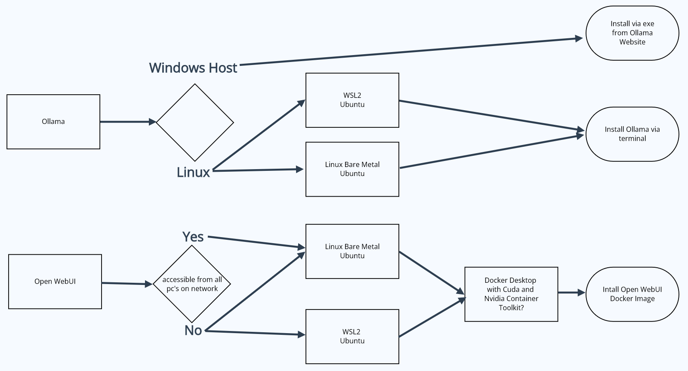
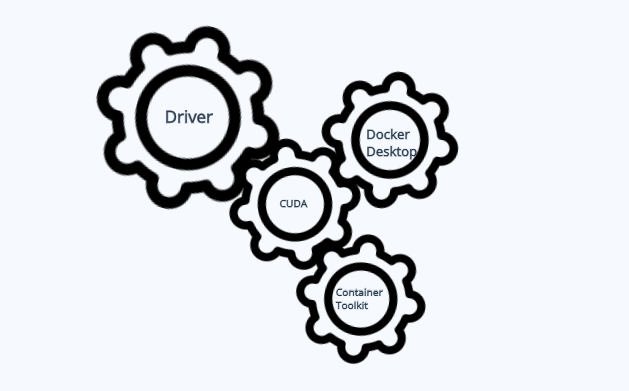

# [*]uNDEr cOnStRuCtIon!!![*]


# Part 2 Theory and Install

## Situational Awareness - Theory



Now that we have installed or updated our drivers, we need to pause a second and think about what our end goal is, cause that will determine how we procced from here. 

If your goal is just to try Ollama you can download the windows version (still a preview version as of this article) and you are good to go, no Cuda or anything else required. Not the recommended way to install but great if you just want to try it.

If your goal is to experiment and integrate Ollama into other frameworks, you want to install Ollama on either bare metal Linux or WSL2. This is how we can add Open WebUI to run on top of Ollama for a cleaner interface. Cuda is required for Open WebUI.

Note: WSL2 Docker networking is isolated using NAT (Network Address Translation), effectively preventing external access to the containerized network, making it inaccessible to other computers on your local network.

If you want to integrate AI into you home lab, so multiple pc can access, or you want to set up a server for your whole family to use, you need a dedicated bare metal "server". This way Docker networking can be setup for local network access. You can run via Proxmox but that is not in scope for this write up.  

## What is That?



## Cuda **(Compute Unified Device Architecture)**

CUDA is a parallel computing platform and programming model developed by NVIDIA. It allows developers to harness the processing power of NVIDIA graphics cards (GPUs) to accelerate computationally intensive tasks, such as machine learning, data science, and scientific simulations.

## Docker Desktop

Docker Desktop is a comprehensive application developed by Docker Inc., designed to provide a user-friendly and integrated development environment for containerizing, testing, and deploying applications using the Docker platform. It enables developers to build, share, and run containerized applications consistently across various environments.

## Nvidia Container Toolkit

The Nvidia Container Toolkit is an open-source container runtime and toolkit for deploying, managing, and running GPU-accelerated containers on Linux systems. It provides a seamless integration with Docker, allowing developers to easily create and run containers with access to the power of NVIDIA GPUs.

## WSL2

WSL (Windows Subsystem for Linux) is an awesome feature that allows you to run a Linux distribution/environment on top of your Windows host, without having to dual boot or use a virtual machine. One of the biggest benefits of WSL over a virtual machine is we get direct access to the hardware without having to do any kind of passthrough. 

Stick with ubuntu for machine learning, cuda toolkit can be install by itself in wsl2 without driver to conflict with driver on host


## Models

When running LLM's locally, the primary constraint is often the available VRAM (Video Random Access Memory) on your graphics card.

Consider this example: The Llama 3 model comes in two sizes - 8B and 70B. A general rule of thumb is that a model's parameter size (e.g., 8B or 70B) determines how much VRAM it requires to run efficiently on the GPU.

Let's take the NVIDIA GeForce RTX 3060 Ti as an example, which boasts 8 GB of GDDR6 VRAM. Unfortunately, this means that a model like Llama 3 (8B) is already too large to fit in memory when you try to load it, because your GPU is already using some of its resources before loading the model. In reality, you would need more like 12GB of VRAM to comfortably run models like Llama 3 (8B). There are definitely models that have lower parameters like phi3 (3B),  gemma2 (2B), and qwen2(0.5B and 1.5B) that you should have no problem running if VRAM is . 

However, there's a twist! If your GPU doesn't have enough VRAM to accommodate the larger model, it will automatically switch to using your CPU instead. While this might not be as fast as running on the GPU, it can still get the job done - albeit with reduced performance.


# Install

If you skipped right to this section, Please make sure you have your drivers updated to the latest version. 

## Ollama Install Windows

This is the quickest and easiest way to install Ollama. Visit https://ollama.com/download and click on Download for Windows (Preview). Double click the file you just downloaded and now you can run Ollama from 


## Ollama Install Linux


The following command will install Ollama on Linux. You can also run the same command to update Ollama
```bash
curl -fsSL https://ollama.com/install.sh | sh
```


## WSL2 Install


## Open WebUI Install

