# Nvidia Drivers


## Windows


You can check which version you are running currently by clicking ```<windows key> + <x>```  and select Device Manager. Click on Display adapter and double click on your gpu. Select the Driver tab at the top and you are looking for the last set of digits in driver version. 


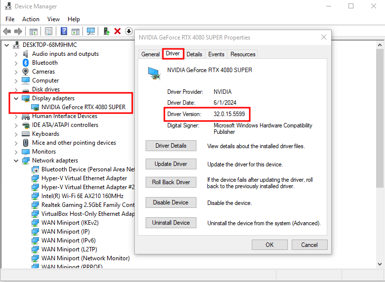

Make sure your drivers are on the latest version by visiting https://www.nvidia.com/download/index.aspx Select the correct Product Type and Series, and if you are working on a laptop make sure you choose the notebook version. 

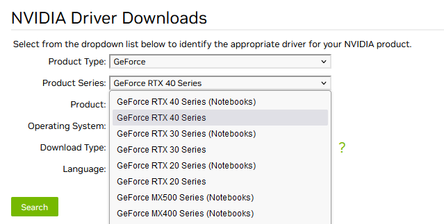


Under Product you will find your specific GPU. Most GPU will have 2 different types you can download. Game Ready Driver (GRD) or Studio Driver (SD). GRD is like the name says better suited for gaming but will run AI no problem, So if do more gaming and want to play with AI you can go this route. If you are going to be doing mostly AI or productivity work, SD is the better choice. I do a little bit of gaming, but my main focus in my lab is cyber/AI research and the SD driver still play games no issues. Both drivers will work, so just chose the best that works for your specific case. 

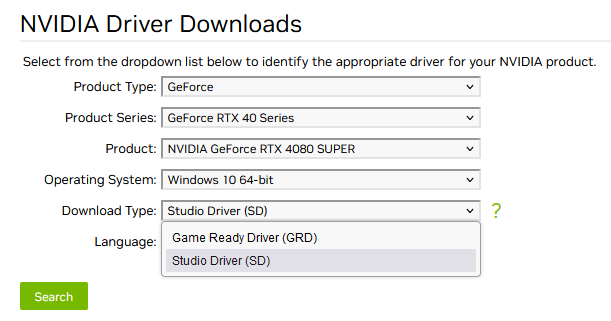


Next choose Windows 10 or 11 and then language. Click on Search and now you can verify if you need to update or good to go! You can see the version listed on the website will match the last set of digits we looked at under Device Manager. Click Download if you need to update.

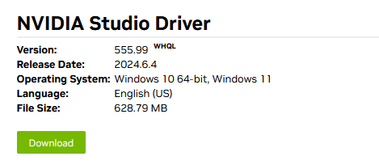


Double click on the Driver file that was just downloaded and the first screen that pops up will ask where you want to save the drivers, just leave in default location.

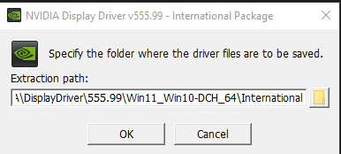


After doing a system check it will ask you if you agree with the license agreement...

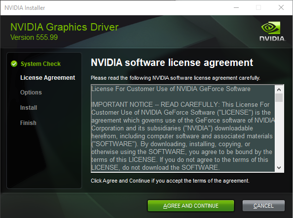


Next we get to choose between Express and Custom. If you were having issues with your drivers previously you can click on custom and there you will see an option to perform a clean installation. Either option will work.

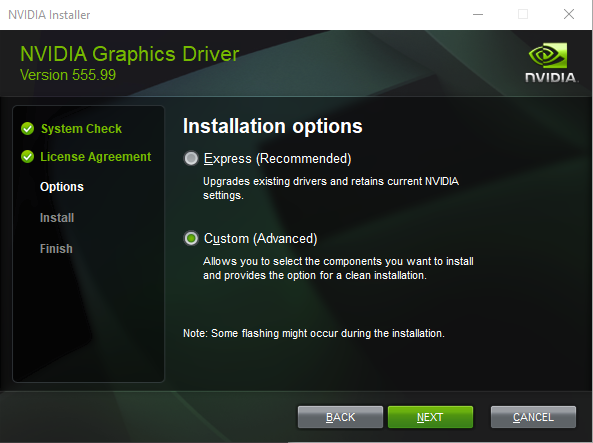


If you are just wanting to work with AI, I recommend to uncheck the NVIDIA GEForce Experience. It is not needed for what we are trying to do here. 

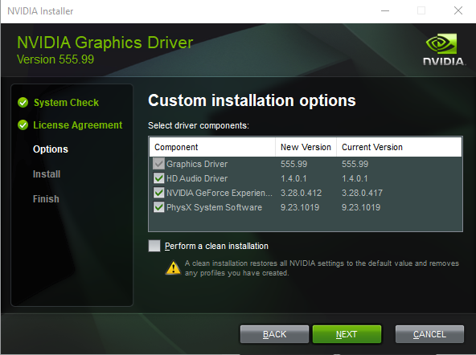


After clicking next here it will start to install the drivers. You might see some flickering on you monitor, this is normal. I recommend restarting your computer after the install has completed. You can also verify the drivers were installed by repeating the steps from earlier by checking in device manager to see if the version display matches the version you just installed.


## Linux Bare Metal Overview

 **Important Note**: If you're running Linux on bare metal, please do not download NVIDIA drivers from their official website! Instead, follow the steps outlined in this guide to ensure a successful installation.

This section is specifically for Bare Metal Linux users. If you're using WSL2, don't worry - we'll cover that in Part 2 of this series! Just make sure to complete the Windows-specific setup procedures outlined above, as WSL2 will build upon those steps.

Downloading via website will not work and could cause you to lose the GUI for your linux distribution. If you have done this, keep reading to find out how to fix this issue and get you GUI back. A lot of tutorials say to install it this way, even nvidia website, but I have not been able to get it working.  Fear not if your GUI will no longer load, and it just freezes while booting and will not load up to the sign in screen. Press ```<ctrl> + <alt> + <F2>``` , this will load up a virtual terminal or tty for short, which is a separate session from the graphical desktop.  Here we can continue on and load the driver the proper way and should fix the GUI not displaying and freezing upon boot.

To install Nvidia driver on Linux we will use the terminal and install via apt package manager. We are going to go over the installation for both Ubuntu 22.04 Jammy Jellyfish, and Debian 12 Bookworm, cause there is some differences. These are a couple of the more popular distribution to use and work well with local LLM frameworks. Let's first take a look at Ubuntu.

## Ubuntu 22.04 Jammy Jellyfish Driver Install


We will be working with a fresh install of Ubuntu. First thing we want to do is an update

```bash
sudo apt update
```

```bash
sudo apt upgrade -y
```

While its doing its update we can check on a few things. press the ```Windows key``` and type software and updates. Click on the software and updates icon to bring up the window. Click on Addition Drivers and we can see what versions are available. One thing we can use nvidia's website for is to confirm which latest version we should be looking for.

Here we can see by searching nvidia's website https://www.nvidia.com/download/index.aspx, and choosign Linux OS, we are looking for version 550

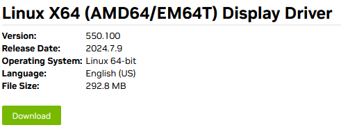

But under Addition Drivers 545 is the latest listed.  

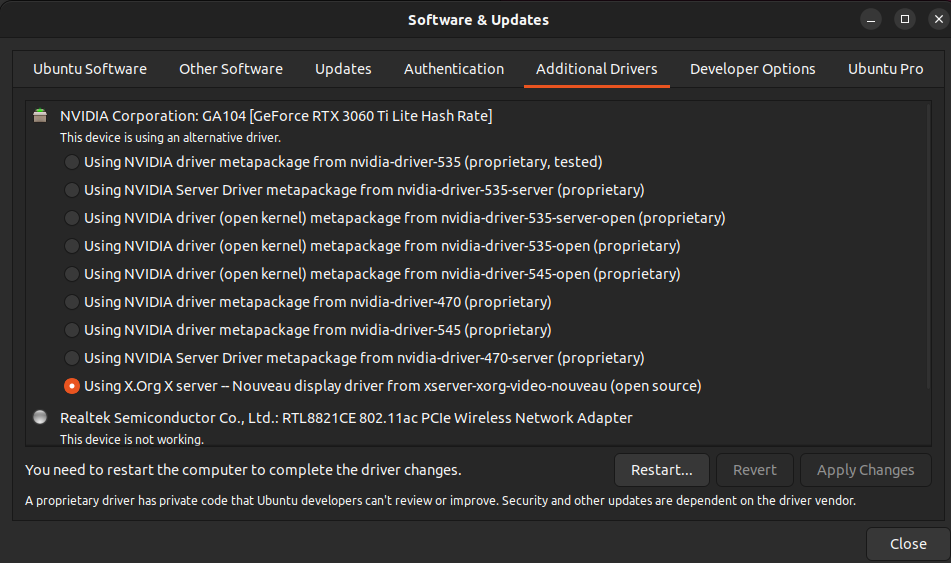


Lets add the ppa graphics repository to our apt source so we can get the latest drivers installed

```bash
sudo add-apt-repository ppa:graphics-drivers/ppa
```

```bash
sudo apt install nvidia-driver-550
```

### **Reboot**

We have 2 methods to verify if everything is working ok. First is to go into settings and scroll all the way to the bottom and click about. There you will see under Graphics if it shows Nvidia. If it shows anything else, the above procedures did not work, but keep in mind it will not show Nvidia here until you reboot the system.

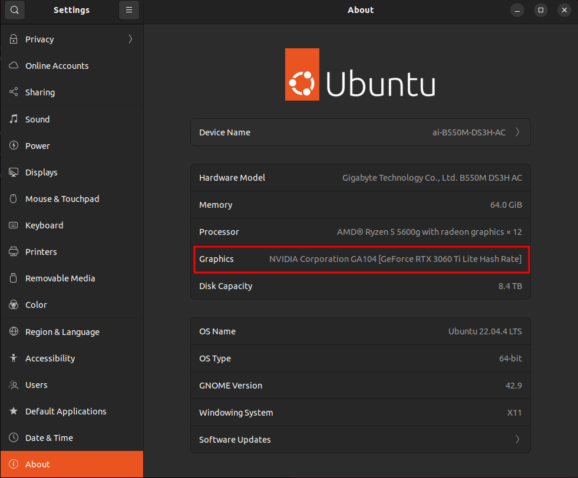

Second method is via terminal. If you don't see the following output something is wrong.
```bash
nvidia-smi
```

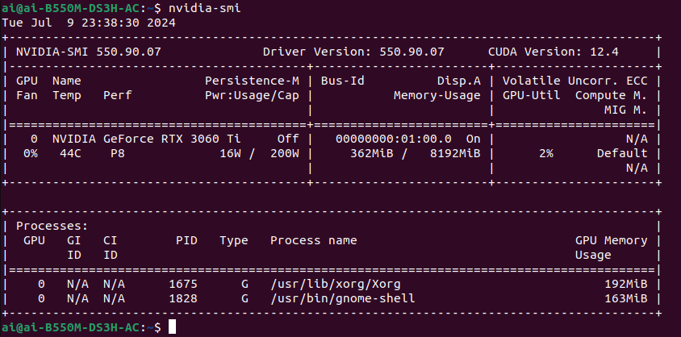


**Note**: This is where I kept running into issues, it would function temporarily, but as soon as I rebooted or installed something else that relied on the drivers, they'd stop working again. Even adding the nvidia-smi command to my PATH environment variable didn't help. In contrast, installing Nvidia drivers via apt package manager takes care of all dependencies and ensures a stable installation from the start.

**Complete**: At this point the driver itself is done, but we can go ahead and install Cuda and Nvidia's Container Toolkit with a few more commands.

First lets install curl

```bash
sudo apt install curl -y
```

Let's verify if gcc compiler is installed

```bash
gcc -v
```

If you get an error about not being installed you can run the following, if not move to next step

```bash
sudo apt install gcc
```

Now it's time to install Cuda toolkit

```bash
sudo apt install nvidia-cuda-toolkit -y
```

Let's verify if it installed correctly

```bash
nvcc -V
```

You should see an output like this

```results
nvcc: NVIDIA (R) Cuda compiler driver
Copyright (c) 2005-2021 NVIDIA Corporation
Built on Thu_Nov_18_09:45:30_PST_2021
Cuda compilation tools, release 11.5, v11.5.119
Build cuda_11.5.r11.5/compiler.30672275_0
```

Now lets install Nvidia's Container Toolkit. This is essential for running GPU-accelerated applications within Docker. It provides the necessary tools and libraries to enable Docker containers to access and utilize NVIDIA GPUs on the host machine.  Copy this and run as one command.

```bash
curl -fsSL https://nvidia.github.io/libnvidia-container/gpgkey | sudo gpg --dearmor -o /usr/share/keyrings/nvidia-container-toolkit-keyring.gpg \
  && curl -s -L https://nvidia.github.io/libnvidia-container/stable/deb/nvidia-container-toolkit.list | \
    sed 's#deb https://#deb [signed-by=/usr/share/keyrings/nvidia-container-toolkit-keyring.gpg] https://#g' | \
    sudo tee /etc/apt/sources.list.d/nvidia-container-toolkit.list
```

```bash
sudo apt-get update
```

```bash
sudo apt-get install -y nvidia-container-toolkit
```


## Debian 12 Bookworm Driver Install


First we must obtain the proper kernel headers for Nvidia driver to build with, we can do a search to verify which kernel our system is using to make sure we install the proper one.  

```bash
uname -a
```

you should see a response like this

```Result
Linux debian 6.1.0-21-amd64 #1 SMP PREEMPT_DYNAMIC Debian 6.1.90-1 (2024-05-03) x86_64 GNU/Linux
```

Now when we run the following command we will know which one to use

```bash
sudo apt-cache search linux-headers
```

```Result
linux-headers-6.1.0-21-amd64 - Header files for Linux 6.1.0-21-amd64  
linux-headers-6.1.0-21-cloud-amd64 - Header files for Linux 6.1.0-21-cloud-amd64  
linux-headers-6.1.0-21-common - Common header files for Linux 6.1.0-21  
linux-headers-6.1.0-21-common-rt - Common header files for Linux 6.1.0-21-rt  
linux-headers-6.1.0-21-rt-amd64 - Header files for Linux 6.1.0-21-rt-amd64  
linux-headers-6.1.0-20-amd64 - Header files for Linux 6.1.0-20-amd64  
linux-headers-6.1.0-20-common - Common header files for Linux 6.1.0-20
```

We see a match with 6.1.0-21-amd64, now we can install the correct Kernel Headers

```bash
sudo apt install linux-headers-6.1.0-21-amd64
```

Next we need to add "contrib", "non-free", and "non-free-firmware" to the /ect/apt/sources.list

```bash
sudo nano /etc/apt/sources.list
```

inside sources.list file add the following line at the bottom. **Please** be careful when editing this file!
press ```<ctrl>+<x>``` to save and exit. press ```<Enter>``` to keep the same name of the file.

```sources.list
deb http://deb.debian.org/debian/ bookworm main contrib non-free non-free-firmware
```

Now we can update and install the drivers

```bash
sudo apt update

sudo apt install nvidia-driver firmware-misc-nonfree
```


**Complete**: At this point the driver itself is done, but we can go ahead and install Cuda and Nvidia's Container Toolkit with a few more commands.

Let's start with Cuda

```bash
sudo apt install nvidia-cuda-dev nvidia-cuda-toolkit
```

Let's verify if it installed correctly

```bash
nvcc -V
```


Now lets install Nvidia's Container Toolkit. Exact same steps we preformed for Ubuntu. Copy this and run as one command.

```bash
curl -fsSL https://nvidia.github.io/libnvidia-container/gpgkey | sudo gpg --dearmor -o /usr/share/keyrings/nvidia-container-toolkit-keyring.gpg \
  && curl -s -L https://nvidia.github.io/libnvidia-container/stable/deb/nvidia-container-toolkit.list | \
    sed 's#deb https://#deb [signed-by=/usr/share/keyrings/nvidia-container-toolkit-keyring.gpg] https://#g' | \
    sudo tee /etc/apt/sources.list.d/nvidia-container-toolkit.list
```

Update and install and you are good to go! 

```bash
sudo apt-get update
```

```bash
sudo apt-get install -y nvidia-container-toolkit
```


